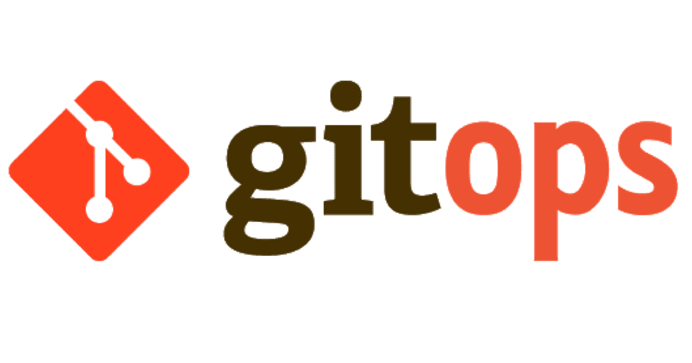
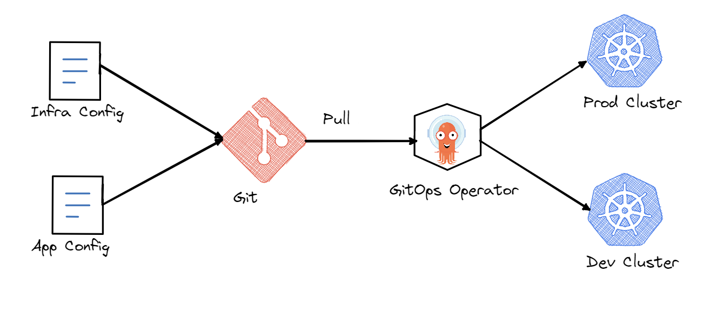

# **GitOps**
## And ephemeral deployments

Koen de Laat

<br/>
<br/>
<br/>

```
Example code available on: https://github.com/koen-de-laat/devops-meetup
```
---
# About me

```yaml
name: Koen de Laat
job: Senior Cloud Architect @ Philips
experience: 
  - Kubernetes in the cloud (EKS)
  - Kubernetes on the edge (K3s)
  - Platform and Products
  - Design, PoCs, Productize 
```

---
# GitOps Architecture



---
# Example deployment

* Multinode kubernetes cluster (home-lab, K3s)
* ArgoCD as GitOps operator
* Common Kubernetes components (e.g. Cert-Manager) 
* Hosting 3 apps (app of apps pattern)
  - [Hello world](https://hello.meetup.koendelaat.nl/)
  - [Doom Game](https://games.meetup.koendelaat.nl/)
  - [Rancher demo](https://demo.meetup.koendelaat.nl/)
* Each app deployed in own namespace `meetup-<__>`
* [**DEMO**](https://argo.koendelaat.nl/applications?showFavorites=false&proj=meetup)

---
# Problem?

* Dev cluster
* Which branch?
  * `develop`
  * What about GitHub flow?
* How do we deploy pull requests?
  * And how to deploy multiple PR in parallel

---
# Multiple solutions

* Use a dev-cluster and only one PR at a time
  * Pros:
    * Simple setup
  * Cons:
    * Only single PR at a time (not developer friendly)
    * Requires logic/discipline to manage which PR
    * Requires dedicated dev-cluster (costs)

---
# Multiple solutions

* Deploy each PR in ephemeral namespace[prefix]
  * Pros:
    * No separate cluster requirement
    * Isolation based on namespaces
  * Cons:
    * Doesn't work for cluster scoped workloads
    * How to manage this?

---
# ArgoCD ApplicationSets
<style scoped>
pre {
  font-size: 80%;
}
</style>
```yaml
apiVersion: argoproj.io/v1alpha1
kind: ApplicationSet
...
spec:
  generators:
    - pullRequest:
        github:
          labels:
            - preview
          owner: koen-de-laat
          repo: devops-meetup
  template:
    metadata:
      name: 'my-apps-pr{{.number}}'
... 
```
<style scoped>ul { padding: 0; list-style: none; }</style>
* [**DEMO**](https://github.dev/koen-de-laat/devops-meetup)

---
# Multiple solutions

* Deploy each PR in ephemeral kubernetes cluster
  * Pros:
    * No separate cluster requirement
    * Fully isolated
  * Cons:
    * Complex to understand
    * Complex to implement

---
# How?

* Run single node K3s in a pod (`rancher/k3s` container)
* Add a project to ArgoCD
* Add an ephemeral cluster to ArgoCD (project scoped)
* Install apps on new cluster

---
# Again with an ArgoCD ApplicationSet

<style scoped>
pre {
  font-size: 80%;
}
</style>
```yaml
apiVersion: argoproj.io/v1alpha1
kind: ApplicationSet
...
spec:
  generators:
    - pullRequest:
        github:
          labels:
            - preview-ephemeral
          owner: koen-de-laat
          repo: devops-meetup
  template:
    metadata:
      name: 'meetup-k3s-pr{{.number}}'
... 
```
<style scoped>ul { padding: 0; list-style: none; }</style>
* [**DEMO**](https://github.dev/koen-de-laat/devops-meetup)

---
# Thank you!

This presentation and used code examples are available:

See: https://github.com/koen-de-laat/devops-meetup
